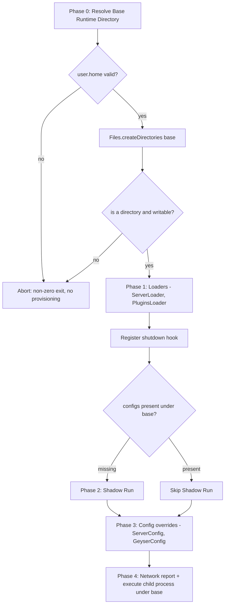

# Design Document

## Overview

The wrapper currently resolves its runtime root as a CWD-relative path: `new File("minecraft_server")` in `App.java`. Every downstream component (`ServerLoader`, `PluginsLoader`, `ServerRunner`, `ServerConfig`, `GeyserConfig`) receives that `File` and builds paths beneath it. Because the path is relative to wherever the process was launched, the extracted server jar, EULA, plugins, configs, and world land in different places depending on launch context. That breaks the "run one file, get a working cross-play server" promise.

This refactor introduces a single source of truth for the runtime root: a per-OS **Base Runtime Directory** resolved as `<user.home>/mclovers` using `java.nio.file`. A new `RuntimeDirectory` component resolves, validates, and creates that directory as the very first startup phase, before any provisioning. The resolved absolute path is then threaded to all existing components, which continue to behave exactly as before but rooted under the stable base directory. All file and path operations move to NIO (`Path`, `Paths`, `Files`), and no new third-party dependency is introduced.

### Goals

- Replace the CWD-relative root with an absolute, per-user root at `<user.home>/mclovers`.
- Resolve, validate (user home present, path is a directory, path is writable), and create the base directory before any artifact is provisioned, failing fast with a clear message and a non-zero exit on any check failure.
- Use NIO throughout for path joining, existence checks, copies, reads, and writes.
- Preserve every existing behavior (shadow-run skip logic, auto-EULA, all-or-nothing plugin report, enforced Bedrock settings, network report, process-tree termination, per-OS launcher resolution).
- Add no new dependencies. Keep Java 21 and JUnit 4.

### Non-Goals

- Making the directory name configurable via environment variable. The name `mclovers` is a fixed constant. An override is out of scope.
- Changing memory flags, plugin set, config semantics, or the network report content.
- Migrating the codebase away from `java.io.File` on public surfaces where doing so would break the existing test style. `File` and `Path` interoperate via `File.toPath()` / `Path.toFile()`; the design uses NIO for the operations while keeping backward-compatible constructors.

## Architecture

### Startup phase ordering

The new resolution phase is inserted as **Phase 0**, before all existing phases. Everything downstream receives the resolved base directory.



### Base directory resolution

The base directory is `Paths.get(System.getProperty("user.home")).resolve("mclovers").toAbsolutePath().normalize()`. Because the value derives from `user.home` and is normalized to an absolute path, the result is identical regardless of the CWD. On Windows, `user.home` reflects `%USERPROFILE%`; on Linux and macOS it reflects `~`. Using `Path.resolve` for the join means no hardcoded separator appears in the code, which keeps the join correct on every platform.

Validation happens in a fixed order before any downstream phase runs:

1. **User home present** - `user.home` must be non-null and non-blank; otherwise abort.
2. **Create** - `Files.createDirectories(base)` creates the base and any missing parents; it is a no-op if the base already exists as a directory.
3. **Is a directory** - if the path exists as a non-directory file, abort with a path-conflict message and do not overwrite it.
4. **Writable** - if the existing directory is not writable, abort with a message identifying the path.

Any failure throws a dedicated checked/unchecked exception that `App.main` catches, prints, and turns into `System.exit(non-zero)`. No downstream component runs after a failed check, so the filesystem is left unmodified by later phases.

### Threading the base directory to components

`App` resolves the base directory once as a `Path`, converts to `File` where legacy APIs require it, and passes it down. The chosen approach:

- **`RuntimeDirectory`** works entirely in `Path`.
- Existing component constructors keep accepting `File` (backward compatibility with `ServerConfigTest`, `AppTest`, and `GeyserConfig(File)`), but their internals migrate file operations to NIO (`Files.*`) and path joining to `Path.resolve`.
- `ServerRunner` continues to accept a `File workingDir` because `ProcessBuilder.directory(File)` requires a `File`. The value passed is now the resolved base directory rather than a CWD-relative one.

**Rationale for keeping `File`-accepting constructors:** the NIO-preference requirement (Requirement 6) concerns the _operations_ (read/write/copy/exists/join/create), not the parameter type. `File` and `Path` are interchangeable views of the same location. Keeping `File` constructors avoids a breaking change to two existing tests and to `ProcessBuilder`/`Properties` interop, while all actual I/O moves to `Files.*`. Where a component benefits from a `Path`-first surface, an overloaded `Path` constructor is added without removing the `File` one.

## Components and Interfaces

### RuntimeDirectory (new)

Resolves and validates the Base Runtime Directory. Runs first in `App.main`.

```java
public final class RuntimeDirectory {
    // Fixed runtime folder name under user.home; not configurable.
    static final String DIR_NAME = "mclovers";

    // Resolve <user.home>/mclovers as an absolute, normalized Path.
    // Validation and creation are performed here in order:
    //   user.home present -> createDirectories -> is-directory -> writable.
    // Throws RuntimeDirectoryException on any failed check.
    public static Path resolveAndPrepare() throws RuntimeDirectoryException;

    // Pure resolution with no side effects; used by tests to assert
    // CWD-independence and separator-free joining. Takes the home value
    // explicitly so tests can supply a temp directory as the home.
    static Path resolve(String userHome) throws RuntimeDirectoryException;
}
```

- `resolveAndPrepare()` reads `System.getProperty("user.home")`, delegates to `resolve`, then creates and validates.
- `resolve(String)` throws when the supplied home is null or blank and never touches the filesystem, which makes it unit-testable without mutating the real user home.
- `RuntimeDirectoryException` (new) carries the offending path and cause for the error message.

### App (modified)

- Removes `SERVER_DIR_NAME` / `new File("minecraft_server")`.
- Adds Phase 0: `Path base = RuntimeDirectory.resolveAndPrepare();` then `File serverDir = base.toFile();`.
- Passes `serverDir` (the resolved base) to `ServerLoader`, `PluginsLoader`, `ServerRunner`, `ServerConfig`, and `GeyserConfig` exactly as today.
- Shadow-run decision, enforced settings (`server-port=25565`, `online-mode=true`), and phase ordering are unchanged apart from being rooted under the base directory.
- A failure from `resolveAndPrepare()` is caught by the existing top-level `catch`, which already exits non-zero; the message is specialized to name the base directory or missing user home.

### ServerLoader (modified)

- Constructor signature unchanged: `ServerLoader(File serverDir, String serverJarName, String eulaFileName)`.
- `ensureDirectoryExists()` uses `Files.createDirectories(serverDir.toPath())` instead of `mkdirs()`.
- `ensureServerJarExists()` keeps `Files.copy(inputStream, path, REPLACE_EXISTING)` from the classpath resource, guarded by `Files.exists` on the target and joining via `serverDir.toPath().resolve(serverJarName)`.
- `ensureEulaAccepted()` switches from `java.io.FileWriter` to `Files.writeString(path, content)` for NIO consistency, still writing only when the EULA is absent.

### PluginsLoader (modified)

- Constructor unchanged: `PluginsLoader(File serverDir)`.
- Creates `plugins` via `Files.createDirectories(base.resolve("plugins"))`.
- Keeps the all-or-nothing check: if any of the four plugin resources is missing on the classpath, it installs none, prints the download-link report, and halts (throws), matching Requirement 3.9 and 7.4.
- Copies each present plugin with `Files.copy(..., REPLACE_EXISTING)` to a `resolve`-joined target.

### ServerRunner (modified)

- Singleton `getInstance(File workingDir, String jarName)` unchanged; `workingDir` is now the resolved base directory.
- `generateConfigs()` and `execute(boolean)` set `pb.directory(workingDir)` where `workingDir` is the base directory, so the child JVM writes world/logs/properties under the base.
- `buildJavaCommand()` unchanged: resolves the launcher from `java.home` + `bin/java` or `bin/java.exe` per `os.name`, with `-Xms1024M -Xmx1024M -jar <jarName> [nogui]`.
- Adds a guard: before launch, if the base directory does not exist or the server jar is absent under it, abort with an error naming the unresolved working directory or jar (Requirement 5.5).

### ServerConfig (modified)

- Constructor `ServerConfig(File file)` retained so `ServerConfigTest` compiles unchanged.
- `load()` and `save()` switch the stream source from `FileInputStream`/`FileOutputStream` to `Files.newInputStream(path)` / `Files.newOutputStream(path)`, satisfying the NIO preference while keeping `java.util.Properties` (which legitimately requires a stream).
- `applyEnvironmentVariables()` semantics unchanged (MOTD, max-players, online-mode, forced `enforce-secure-profile=false`, pause-when-empty, view/simulation distance, `max-tick-time=60000`).

### GeyserConfig (modified)

- Constructor `GeyserConfig(File serverDir)` unchanged.
- Path construction moves to `serverDir.toPath().resolve("plugins").resolve("Geyser-Spigot").resolve("config.yml")` (no hardcoded separators).
- `configure()` behavior unchanged: read via `Files.readString`, regex-replace `mtu -> 1200` and `auth-type -> floodgate` independently, warn per absent key, write via `Files.writeString(..., TRUNCATE_EXISTING)` only when changed, skip with a message when the file is absent.

### NetworkReporter (unchanged)

- `printReport()` has no file I/O and stays in the execute phase, called before the blocking run.

## Data Models

The refactor is structural, not data-bearing. The relevant "models" are the resolved paths and the fixed constants.

### Path model

| Name | Type | Value / derivation | Notes |
| --- | --- | --- | --- |
| `userHome` | `String` | `System.getProperty("user.home")` | Must be non-null, non-blank. |
| `base` | `Path` | `Paths.get(userHome).resolve("mclovers").toAbsolutePath().normalize()` | Single source of truth for the runtime root. |
| `serverJar` | `Path` | `base.resolve("server.jar")` | Extracted from classpath if absent. |
| `eula` | `Path` | `base.resolve("eula.txt")` | Auto-accepted if absent. |
| `pluginsDir` | `Path` | `base.resolve("plugins")` | Created if absent. |
| `serverProperties` | `Path` | `base.resolve("server.properties")` | Read/modified/saved in place. |
| `geyserConfig` | `Path` | `base.resolve("plugins").resolve("Geyser-Spigot").resolve("config.yml")` | Edited in place only. |

### Constants

| Constant               | Location           | Value                      |
| ---------------------- | ------------------ | -------------------------- |
| `DIR_NAME`             | `RuntimeDirectory` | `"mclovers"` (fixed)       |
| `SERVER_JAR_NAME`      | `App`              | `"server.jar"` (unchanged) |
| `EULA_FILE_NAME`       | `App`              | `"eula.txt"` (unchanged)   |
| enforced `server-port` | `App`              | `"25565"` (unchanged)      |
| enforced `online-mode` | `App`              | `"true"` (unchanged)       |

### Enforced settings (unchanged semantics)

The enforced Bedrock-critical settings are applied after `applyEnvironmentVariables()`, so they always override any environment-supplied value: `enforce-secure-profile=false` (forced in `ServerConfig`), `server-port=25565`, and `online-mode=true` (forced in `App`).

## Correctness Properties

_A property is a characteristic or behavior that should hold true across all valid executions of a system - essentially, a formal statement about what the system should do. Properties serve as the bridge between human-readable specifications and machine-verifiable correctness guarantees._

The path-resolution and config-transformation logic in this refactor are pure functions of their inputs (a home string, a base path, a set of key/value pairs, a config text), which makes them well suited to property-based testing. The properties below were derived from the prework analysis and consolidated to remove redundancy (for example, the several OS-specific restatements of resolution collapse into one CWD-independence property, and the create/reuse criteria collapse into one idempotence property).

### Property 1: Resolution is absolute, CWD-independent, and rooted at user.home/mclovers

_For any_ non-blank user home string, resolving the base directory produces an absolute path whose final path segment is `mclovers` and whose parent corresponds to the supplied home, and the result is identical no matter what the process current working directory is.

**Validates: Requirements 1.1, 1.2, 1.3, 1.4, 1.5, 9.1**

### Property 2: Idempotent create and reuse

_For any_ base directory location, preparing it once creates it (with any missing parents) as a directory, and preparing it again when it already exists reuses it without deleting, recreating, or modifying its existing contents.

**Validates: Requirements 1.6, 2.1, 2.2, 2.3, 3.6**

### Property 3: All provisioned target paths are absolute and rooted under the base directory

_For any_ resolved base directory, every path the wrapper provisions or reads (server jar, EULA, plugins directory, each plugin jar, `server.properties`, and the Geyser `config.yml`) is an absolute path that starts with the base directory rather than being resolved against the current working directory.

**Validates: Requirements 3.10, 4.1, 4.2, 5.4**

### Property 4: Path joining is separator-free

_For any_ child segment name joined onto the base directory, the joined path equals the result of NIO path resolution (`base.resolve(child)`) and contains no hardcoded platform separator introduced by the join expression.

**Validates: Requirements 6.3**

### Property 5: Existing provisioned files are preserved

_For any_ pre-existing server jar or EULA file with arbitrary content, running provisioning leaves that file's content byte-for-byte unchanged (no overwrite).

**Validates: Requirements 3.3, 3.5**

### Property 6: server.properties round-trip

_For any_ set of valid property key/value pairs, saving them to `server.properties` and then loading the file back yields the same key/value pairs.

**Validates: Requirements 4.3**

### Property 7: Enforced settings always win over environment input

_For any_ combination of environment-supplied values, the final saved configuration has `server-port=25565`, `online-mode=true`, and `enforce-secure-profile=false` regardless of what the environment supplied.

**Validates: Requirements 7.5, 7.6**

### Property 8: Shadow-run decision equals not(both configs present)

_For any_ combination of presence of `server.properties` and the Geyser `config.yml` under the base directory, the wrapper performs the shadow run exactly when at least one of the two files is absent, and skips it exactly when both are present.

**Validates: Requirements 7.1, 7.2**

### Property 9: Geyser in-place edit enforces keys and preserves surrounding content

_For any_ Geyser config text that contains the `mtu` and `auth-type` keys among arbitrary surrounding lines, editing sets `mtu` to `1200` and `auth-type` to `floodgate` while leaving every other line unchanged; for any config missing a key, that key is neither created nor corrupted.

**Validates: Requirements 4.4, 4.5**

### Property 10: Paths with spaces behave identically to paths without

_For any_ base directory whose absolute path contains space characters, provisioning artifacts, editing configuration, and resolving the launch working directory succeed with the same outcomes as for an otherwise-identical space-free base directory.

**Validates: Requirements 8.5**

## Error Handling

Error handling centers on failing fast in Phase 0 so the filesystem is never left in a partial state that later phases depend on.

### Resolution and validation failures (RuntimeDirectory)

A new `RuntimeDirectoryException` carries the offending path and cause. `App.main` catches it in the existing top-level handler, prints a clear message, and calls `System.exit(1)`.

| Condition | Handling | Requirements |
| --- | --- | --- |
| `user.home` null or blank | Abort before any filesystem access; message names the missing user home. | 1.7, 8.1 |
| Base path exists as a non-directory file | Abort; message reports the path conflict; existing file is not deleted or overwritten. | 2.4, 8.2 |
| `Files.createDirectories` fails | Abort; message names the base path and cause; already-created parents are left intact. | 1.8, 2.5, 8.2 |
| Base directory not writable | Abort; message names the base path. | 8.3 |
| Any check fails | No downstream phase runs, so no artifact is provisioned. | 8.4 |

### Provisioning failures (ServerLoader, PluginsLoader)

| Condition | Handling | Requirements |
| --- | --- | --- |
| Server jar resource missing on classpath when extraction needed | Throw `IOException` with the missing resource name; startup halts. | 3.2 |
| `plugins` subdirectory creation fails | Throw with the failed path; startup halts. | 3.7 |
| One or more plugin resources missing | Install none, print the download-link report with each missing plugin name and link, throw `RuntimeException`. | 3.9, 7.4 |

### Launch failures (ServerRunner)

| Condition | Handling | Requirements |
| --- | --- | --- |
| Base directory absent or server jar absent at launch | Abort launch; error names the unresolved working directory or jar. | 5.5 |

### Config edit degradation (GeyserConfig)

Absent Geyser keys are skipped with a warning rather than treated as fatal, so a partial config is never corrupted (Requirement 4.5). `ServerConfig.load()` on a missing file starts from empty properties, matching current behavior.

## Testing Strategy

### Framework and constraints

Tests use **JUnit 4** (the only test dependency in the version catalog) following the existing `ServerConfigTest` and `AppTest` style. No property-based testing library is available in the version catalog, and adding one (for example jqwik) would violate Requirement 6.2's no-new-dependency constraint. Therefore each correctness property is implemented as a **single property-style JUnit 4 test** that exercises the property over a generated or enumerated set of inputs (a loop of randomized/representative values driven by `java.util.Random` and explicit boundary cases), asserting the property holds for every input. Each such test runs **at least 100 iterations** for properties over open input spaces (home strings, property maps, segment names, config texts) and enumerates the full space for finite ones (for example the four presence combinations in Property 8).

All filesystem tests use **temp directories** (`Files.createTempDirectory`) as the simulated home/base so the real user home is never touched. `RuntimeDirectory.resolve(String userHome)` takes the home explicitly precisely to make this possible without mutating `System` properties across threads.

### Property test mapping

Each property test is tagged with a comment referencing its design property, in the format: `// Feature: refactor01-fileio, Property {number}: {property_text}`

| Property | Test approach | Iterations |
| --- | --- | --- |
| 1 Resolution absolute + CWD-independent | Generate many home strings (including spaces, nested paths); assert filename `mclovers`, absolute, parent matches home, and repeated resolution is equal. | >= 100 |
| 2 Idempotent create/reuse | Under a temp home, create base, seed random files, prepare again, assert seeded files unchanged and base still a directory. | >= 100 |
| 3 Targets rooted under base | For many temp bases, assert every provisioned/resolved path `startsWith` base and `isAbsolute`. | >= 100 |
| 4 Separator-free join | For many child segment names, assert `join(base, child)` equals `base.resolve(child)`. | >= 100 |
| 5 Existing files preserved | Seed jar/EULA with random bytes, run provisioning, assert bytes unchanged. | >= 100 |
| 6 server.properties round-trip | Generate random valid key/value maps, save then load, assert equality. | >= 100 |
| 7 Enforced settings win | Simulate arbitrary env values, apply + enforce, assert `server-port=25565`, `online-mode=true`, `enforce-secure-profile=false`. | >= 100 |
| 8 Shadow-run decision | Enumerate the four (props, geyser) presence combinations, assert decision equals not(both present). | 4 (full space) |
| 9 Geyser in-place edit | Generate configs embedding `mtu`/`auth-type` among random lines (and configs missing keys), assert enforced values, surrounding lines intact, absent keys not injected. | >= 100 |
| 10 Paths with spaces | Use temp home dirs containing spaces; assert all joins resolve and artifacts provision identically to a space-free base. | >= 100 |

### Unit and example tests

Focused example-based tests cover deterministic and error branches that are not universal properties:

- EULA content is exactly `eula=true` when absent (3.4, 7.3).
- Server jar resource missing throws with the resource name (3.2).
- Plugins all-or-nothing: a simulated missing resource installs none, prints the report, and throws (3.9, 7.4).
- `user.home` null/blank throws and creates nothing (1.7, 8.1).
- Base path occupied by a regular file halts without overwrite (2.4, 8.2, 8.4).
- Launch guard aborts when base or jar is absent (5.5).
- Launcher suffix is `bin/java.exe` for `os.name` containing `win`, else `bin/java` (9.3).
- The existing `ServerConfigTest` and `AppTest` continue to pass unchanged, confirming backward-compatible constructors.

### Integration and smoke checks

- Child-process working directory is the base directory for shadow and blocking runs (5.1, 5.2, 5.3); verified via a testable seam on the `ProcessBuilder` configuration or a 1-2 example run rather than PBT, since behavior does not vary with input.
- Docker/Temurin Java 21 resolution from the container home (9.2) is validated by the CI matrix run rather than a unit test.
- Build/config smoke checks: version catalog contains only Guava and JUnit (6.2); toolchain is Java 21 (9.4).

### Not covered by property tests (rationale)

- Writability failure (8.3) is platform-dependent and flaky to force portably; tested where the OS supports marking a directory read-only, otherwise documented as platform-conditional.
- Console-output-only behaviors (network report printing, 7.7) are side-effect-only and covered by a single smoke assertion.
- Steering documentation updates (10.1, 10.2, 10.3) are documentation changes verified by review during the tasks phase, not by automated tests.

### Steering documentation note

Requirement 10 requires updating `product.md`, `structure.md`, and `tech.md` to describe the runtime location as the per-OS Base Runtime Directory (`<user.home>/mclovers`) rather than a project-relative `minecraft_server/`. This is a documentation task tracked in the tasks phase, not a code change, and is called out here so it is not lost.

## Requirements Traceability

| Requirement | Addressed by |
| --- | --- |
| 1 Resolve stable per-OS base directory | `RuntimeDirectory.resolve`/`resolveAndPrepare`; Property 1; Architecture > Base directory resolution |
| 2 Idempotent create and reuse | `RuntimeDirectory` create/validate order; Property 2; example tests 2.4 |
| 3 Provision artifacts under base | `ServerLoader`, `PluginsLoader` (NIO); Properties 3, 5; example tests 3.2/3.4/3.9 |
| 4 Config read/write under base | `ServerConfig` (Files streams), `GeyserConfig` (Path join); Properties 3, 6, 9 |
| 5 Launch child process under base | `ServerRunner` `pb.directory(base)` + launch guard; Property 3; integration 5.1-5.3; example 5.5 |
| 6 Prefer standard-library NIO | `Files.*` and `Path.resolve` throughout; Property 4; smoke 6.2 |
| 7 Preserve existing behaviors | `App` phase ordering; Properties 7, 8; examples 3.4/3.9; smoke 7.7 |
| 8 Base-directory edge/error cases | `RuntimeDirectory` validation + `RuntimeDirectoryException`; Property 10; edge tests 1.7/2.4/8.3/8.4 |
| 9 Correct across platforms | `RuntimeDirectory` (user.home), `ServerRunner.buildJavaCommand` per-OS launcher, Java 21 toolchain; Property 1; examples 9.3; CI matrix 9.2 |
| 10 Update steering documentation | Tasks-phase documentation updates to `product.md`, `structure.md`, `tech.md`; Testing Strategy > Steering documentation note |
