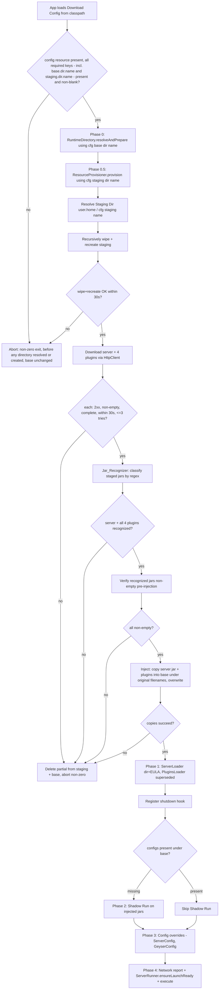

# Design Document

## Overview

Today the wrapper ships every jar it needs as a classpath resource. `ServerLoader.ensureServerJarExists()` extracts `/server.jar` from the bundle, and `PluginsLoader.install()` copies the four plugin jars from `/plugins/*` into `base/plugins`. Because those jars are frozen at build time, any Minecraft client-version increase produces a version mismatch that takes the server down until the bundle is rebuilt and redeployed.

This refactor makes provisioning dynamic. A single bundled `.properties` **Download Config** becomes the source of truth for the two runtime directory names as well as the download URLs and recognition patterns. `App` loads and validates that config **first**, before any directory resolution, then feeds the base directory name into `RuntimeDirectory` and the staging directory name into the new `ResourceProvisioner`. Neither directory name is a hardcoded literal in compiled code; the defaults `mclovers` (base) and `resources` (staging) ship inside the config file as documented defaults, not as behavioral fallbacks.

A new **`ResourceProvisioner`** component runs immediately after Phase 0 (`RuntimeDirectory.resolveAndPrepare(baseDirName)`) and before every downstream phase. On each run it:

1. Resolves a dedicated **Staging Directory** at `<user.home>/<staging-dir-name>` (NIO, separator-free, absolute), where the staging directory name is read from the Download Config (default `resources`).
2. Recursively wipes and recreates that directory so no prior download survives.
3. Downloads the latest server jar and the four required plugin jars over the internet using the JDK `java.net.http.HttpClient`, driven by URLs read from a bundled `.properties` **Download Config**.
4. Recognizes and classifies each staged jar by its version-tagged filename using regular expressions supplied by the config.
5. Injects the recognized jars into the Base Runtime Directory under their original downloaded filenames (the server jar under its versioned name such as `purpur-1.21.4-2367.jar`, each plugin under its own downloaded name in `plugins/`), preserving each `Original_Filename` verbatim, so both the Shadow Run and the real run launch from the freshly downloaded jars. Because the injected server jar keeps its versioned name rather than a fixed `server.jar`, the provisioner hands that recognized filename to `ServerRunner`, which launches it via `-jar <originalServerFilename>`.

Failure is fatal by design. If the internet is unavailable, a download fails or is truncated, an expected jar cannot be recognized, or the config is missing/invalid, the wrapper halts with a clear, actionable error and a non-zero exit, cleaning partial artifacts from both the Staging Directory and the base, and launches no child process. Running a frozen jar would reintroduce the exact downtime this refactor exists to eliminate.

The classpath resources directory (`app/src/main/resources`) stops carrying jars entirely. It holds only the Java-standard `.properties` Download Config, which now supplies both directory names in addition to the URLs and patterns. `ServerLoader` loses its jar-extraction responsibility (keeping only EULA acceptance and directory creation), and `PluginsLoader`'s classpath-copy responsibility is superseded by `ResourceProvisioner`.

### Goals

- Fetch the latest server jar and four plugin jars over the internet on every run, so the server matches current clients without a rebuild.
- Read both runtime directory names from the shared Download Config (base directory name, default `mclovers`; staging directory name, default `resources`), treat the config as the single source of truth for both names, and hold no hardcoded directory-name literal in compiled code. `App` loads the config before any directory is resolved, feeds the base name to `RuntimeDirectory` and the staging name to `ResourceProvisioner`.
- Stage downloads in a per-run, wiped-and-recreated `<user.home>/<staging-dir-name>`, then inject recognized jars into `<user.home>/<base-dir-name>` under their original downloaded filenames (the server jar and each plugin keep the versioned name they were downloaded and recognized under), and launch the server jar by that recognized name.
- Recognize jars by version-tagged filename via configurable regex, distinguishing the server jar and each of the four plugins, with a deterministic tie-break and server-over-plugin precedence.
- Fail fast on any provisioning error with a non-zero exit, cleaning partial artifacts, so nothing stale is ever executed.
- Hold every URL, regex, and directory name in a bundled `.properties` config rather than compiled literals; remove all bundled jars from resources.
- Preserve every existing downstream behavior once jars are provisioned (EULA acceptance, shadow-run skip logic, enforced Bedrock settings, Geyser edit, network report, process-tree termination, per-OS launcher resolution).
- Use only the JDK standard library (`java.net.http.HttpClient`, `java.nio.file`, `java.util.Properties`, `java.util.regex`). Add no new dependency. Keep Java 21 and JUnit 4.

### Non-Goals

- Introducing a runtime override (environment variable, CLI flag) for either directory name. The names are read from the bundled Download Config only; they are not fixed compiled constants, but neither are they overridable at launch beyond editing the shipped config file.
- Caching or reusing a prior download when the network is down. Fallback to a stale or bundled jar is explicitly forbidden (Requirement 6.2).
- Checksum/signature verification of downloaded jars. Integrity checking is limited to non-empty and complete-transfer verification (Requirement 7). A stronger integrity model is out of scope.
- Changing memory flags, the plugin set, config semantics, or the network report content.
- Changing the Shadow-Run mechanism, the enforced Bedrock settings, or the `ServerRunner` launch/termination logic beyond feeding it the freshly injected jars and the recognized server jar `Original_Filename` to launch by.

## Architecture

### Startup phase ordering

Loading and validating the Download Config now moves to the very **front** of startup, ahead of base-directory resolution, because the config supplies the directory names that resolution needs. The order is: (a) `App` loads the Download Config from the classpath and validates it (a missing resource, or any required key that is absent or blank, including the two directory-name keys, aborts before anything else runs); (b) **Phase 0**: `RuntimeDirectory.resolveAndPrepare(cfg.baseDirName())` resolves, creates, and validates the Base Runtime Directory using the config-provided base directory name; (c) **Phase 0.5**: `ResourceProvisioner` resolves the Staging Directory using the config-provided staging directory name, then wipes, downloads, recognizes, and injects; (d) everything downstream is unchanged apart from launching the freshly injected jars.



Both failure sinks (`X` for config, including the two directory-name keys, and `Y` for staging/download/recognition/injection) exit non-zero with nothing stale executed. The config check `X` now fires before Phase 0, so a missing or blank directory-name key aborts before any directory is resolved or created (Requirement 5.10). Because provisioning completes before the Shadow-Run decision, a provisioning failure prevents both the Shadow Run and the blocking run (Requirements 2.3, 4.4, 6.5).

### Staging Directory resolution

The Staging Directory is `Paths.get(System.getProperty("user.home")).resolve(stagingDirName).toAbsolutePath().normalize()`, where `stagingDirName` is the config-provided staging directory name (default `resources`), mirroring the resolution style `RuntimeDirectory` already uses for the base. Deriving from `user.home` and normalizing to absolute makes the result CWD-independent, and `Path.resolve` introduces no hardcoded separator, keeping the join correct on every platform (Requirements 1.1, 5.9, 10.4).

### Wipe and recreate

Each run recursively deletes the existing Staging Directory and recreates it empty:

- **Delete** walks the tree depth-first (`Files.walk` reverse-sorted, or `Files.walkFileTree`) and deletes each entry with `Files.deleteIfExists`. A missing directory makes the delete a no-op (Requirement 1.4).
- **Recreate** calls `Files.createDirectories(staging)` so the recreated directory exists and is empty (Requirement 1.3).
- The combined wipe-and-recreate runs on a bounded operation guarded by a **30-second deadline**; exceeding it aborts with a timeout error naming the path (Requirement 1.7). A locked or in-use entry that cannot be deleted aborts naming the path and cause (Requirement 1.6).

### Download

For each of the five artifacts, `ResourceProvisioner` performs an HTTP GET through a shared `HttpClient` configured with `followRedirects(NORMAL)` (redirects followed to the final resource, and the JDK client bounds redirect chains; the design targets at most 5 chained redirects per Requirement 2.4) and a 30-second connect timeout, with a 30-second request timeout on each `HttpRequest` (Requirements 2.7, 6.1).

Because injection now preserves each jar's `Original_Filename`, the download step derives the real staged filename from the HTTP response rather than a config-supplied target name. The `Original_Filename` is resolved from the response in order of preference: (1) the `filename` parameter of a `Content-Disposition` response header when present; else (2) the last path segment of the final (post-redirect) request URI. This yields the versioned name the artifact actually ships under (for example `purpur-1.21.4-2367.jar` or `Geyser-Spigot-2.4.2-b678.jar`), so the recognized file already carries its real name and injection can copy it verbatim.

The response is streamed to a **temporary file** in the Staging Directory (for example `<artifact>.part`), then, only after the transfer completes and passes non-empty verification, atomically moved to its resolved `Original_Filename` via `Files.move(..., ATOMIC_MOVE, REPLACE_EXISTING)` (falling back to a plain `REPLACE_EXISTING` move where atomic move is unsupported). This guarantees an interrupted download never leaves a recognizable jar in staging (Requirements 6.6, 7.3).

Each artifact is attempted up to **3 times**; after 3 failures for the same artifact the provisioner does not fall back to any prior or bundled jar and halts (Requirement 6.2). A non-success HTTP status aborts with the artifact name, URL, and status (Requirement 2.8). A zero-byte or truncated file is treated as failed, deleted from staging (confirming non-existence), and the run halts (Requirement 7.1-7.5).

### Recognition and injection

Once the five downloads are staged, the `Jar_Recognizer` lists the staging entries and classifies each by matching its filename against the configured regex patterns:

- Server-jar pattern selects the server jar; each plugin has its own pattern.
- A file matching both the server pattern and a plugin pattern is classified as the server jar only (server-over-plugin precedence, Requirement 3.3).
- When more than one staged file matches a single artifact's pattern, the one whose filename is first in case-sensitive ASCII-lexicographic ascending order is chosen, and the chosen file is recorded (Requirement 3.6).
- If the server pattern matches nothing, or any one of the four plugin patterns matches nothing, the run halts with a naming error and leaves staged files unmodified (Requirements 3.4, 3.5).

Injection copies the recognized server jar into `base/<originalServerFilename>` and each recognized plugin jar into `base/plugins/<originalPluginFilename>` using `Files.copy(..., REPLACE_EXISTING)`, creating `base/plugins` first if absent (Requirement 4). The destination name for each artifact is `source.getFileName().toString()`, so the `Original_Filename` is preserved verbatim and any existing file of that same name is overwritten. Each recognized file is re-verified non-empty immediately before its copy (Requirements 7.6, 7.7). The provisioner records the injected server jar's `Original_Filename` and hands it to `ServerRunner`, which launches it via `-jar <originalServerFilename>` rather than a fixed `server.jar` (Requirements 4.5, 8.13).

### Threading into App

`App.main` first loads the Download Config from the classpath, then resolves the base using the config-provided base directory name (`RuntimeDirectory.resolveAndPrepare(cfg.baseDirName())`), then constructs and runs `ResourceProvisioner` (holding the same config, so it uses `cfg.stagingDirName()`) before `ServerLoader`/`PluginsLoader`. Both loading the config and provisioning throw dedicated exceptions on failure; `App.main` catches `ProvisioningException` (which `DownloadConfig.load` also raises) in a specialized handler placed before the `RuntimeDirectoryException` handler, prints the actionable message, and calls `System.exit(1)` before any directory resolution, loader, or Shadow Run runs. Because the config load precedes Phase 0, a missing or blank directory-name key aborts before `RuntimeDirectory` is even invoked (Requirement 5.10).

## Components and Interfaces

### RuntimeDirectory (modified, cross-spec change to refactor01)

`RuntimeDirectory` from refactor01 currently exposes `resolveAndPrepare()` (no argument) with a fixed `DIR_NAME = "mclovers"`, plus a package-private `resolve(String userHome)`. This refactor requires the base directory name to come from the Download Config, so the class gains **additive, backward-compatible name-parameterized overloads**. No existing signature is removed, so refactor01's existing tests (`AppTest`, `ServerConfigTest`, and any `RuntimeDirectory` tests) continue to compile and pass unchanged.

```java
public final class RuntimeDirectory {

    // Retained as the documented default directory name.
    static final String DIR_NAME = "mclovers";

    // New: name-parameterized prepare. Resolves, creates, and validates
    // <user.home>/<dirName>. Used by App with cfg.baseDirName().
    public static Path resolveAndPrepare(String dirName) throws RuntimeDirectoryException;

    // Retained overload: delegates to resolveAndPrepare(DIR_NAME).
    public static Path resolveAndPrepare() throws RuntimeDirectoryException;

    // New: name-parameterized, side-effect-free resolution for tests.
    static Path resolve(String userHome, String dirName) throws RuntimeDirectoryException;

    // Retained overload: delegates to resolve(userHome, DIR_NAME).
    static Path resolve(String userHome) throws RuntimeDirectoryException;
}
```

- The new `resolve(String userHome, String dirName)` performs the same null/blank check on `userHome`, additionally rejects a null or blank `dirName`, and returns `Paths.get(userHome).resolve(dirName).toAbsolutePath().normalize()` (no hardcoded separator, CWD-independent).
- The new `resolveAndPrepare(String dirName)` reads `System.getProperty("user.home")`, delegates to the new `resolve`, then applies the identical create -> is-directory -> writable validation order already present in refactor01.
- The retained no-argument `resolveAndPrepare()` and single-argument `resolve(String)` delegate to the new overloads with `DIR_NAME`, so `DIR_NAME` survives only as the documented default and no behavior changes for callers that do not pass a name.
- `App` calls the new `resolveAndPrepare(cfg.baseDirName())`, so the base name it uses comes from config, not from `DIR_NAME` (Requirements 5.8, 5.9, 5.11).

### ResourceProvisioner (new)

Orchestrates wipe, download, recognition, and injection. Runs in `App.main` after Phase 0 and before the loaders. It no longer defines a hardcoded staging-folder constant; the staging directory name is supplied through the `DownloadConfig` it holds.

```java
public final class ResourceProvisioner {

    private final Path baseDir;        // resolved Base Runtime Directory
    private final DownloadConfig config; // supplies staging dir name, URLs, patterns
    private final Downloader downloader; // seam: HttpClient-backed by default

    public ResourceProvisioner(Path baseDir, DownloadConfig config, Downloader downloader);

    // Full pipeline: wipe -> download -> recognize -> verify -> inject.
    // Resolves staging under config.stagingDirName(). Returns the injected
    // server jar's Original_Filename (its versioned name under the base) so
    // App can hand it to ServerRunner as the launch jar. Throws
    // ProvisioningException on any failure, having cleaned partial artifacts
    // from both the staging directory and the base.
    public String provision() throws ProvisioningException;

    // Side-effect-free staging resolution; name-parameterized and testable
    // with a supplied home and staging name.
    static Path resolveStaging(String userHome, String stagingDirName) throws ProvisioningException;

    // Wipe + recreate within a 30s deadline; returns the empty staging dir.
    Path wipeAndRecreateStaging() throws ProvisioningException;
}
```

- The former `STAGING_DIR_NAME` constant is **removed**; the staging name is read from `config.stagingDirName()` (default `resources`), so no directory-name literal is compiled into `ResourceProvisioner` (Requirements 5.9, 5.11).
- `resolveStaging(String userHome, String stagingDirName)` mirrors `RuntimeDirectory.resolve`: it takes the home and name explicitly so tests can supply a temp directory and a chosen name, performs no filesystem access, and throws when the home is null/blank (Requirements 10.5).
- `provision()` is the single public entry point invoked by `App`. It resolves staging under `config.stagingDirName()`, and returns the injected server jar's `Original_Filename` (equal to `recognizedServerJar.getFileName().toString()`), which `App` passes to `ServerRunner.getInstance(base, originalServerFilename)`.
- Injection uses `source.getFileName().toString()` as the destination name for every artifact, so the recognized `Original_Filename` is preserved verbatim (Requirements 4.1, 4.2, 4.5).

### Downloader (new seam)

An interface isolating HTTP so downloads are testable without real internet.

```java
public interface Downloader {
    // Fetch url into the given staging directory under a temp name, verify the
    // transfer completed and is non-empty, then atomically move to the
    // Original_Filename derived from the response (Content-Disposition filename,
    // else the final redirected URI's last path segment). Returns the staged
    // Path whose getFileName() is that Original_Filename.
    // Retries up to maxAttempts; enforces the per-request timeout and redirect cap.
    Path download(String url, Path stagingDir) throws ProvisioningException;
}
```

The default implementation, `HttpDownloader`, wraps a JDK `HttpClient.newBuilder().followRedirects(Redirect.NORMAL).connectTimeout(Duration.ofSeconds(30)).build()` and uses `HttpResponse.BodyHandlers.ofInputStream()` streamed to the `.part` file. It reads the response's `Content-Disposition` header (falling back to the final `HttpResponse.uri()` path segment) to determine the `Original_Filename` under which the verified download is staged. Tests supply a fake `Downloader` or point `HttpDownloader` at a local `com.sun.net.httpserver.HttpServer` that sets a chosen `Content-Disposition` filename.

### JarRecognizer (new subcomponent)

Pure classification of staged filenames against configured regex. No I/O beyond listing the staging directory.

```java
final class JarRecognizer {

    JarRecognizer(RecognitionPatterns patterns);

    // Classify staged files; returns the chosen server jar and plugin jars.
    // Applies server-over-plugin precedence and ASCII-lexicographic tie-break.
    // Throws ProvisioningException naming any artifact that matches nothing.
    RecognitionResult recognize(List<Path> stagedFiles) throws ProvisioningException;
}
```

Splitting recognition into a pure component keeps it directly property-testable over generated filename sets without touching the network or filesystem.

### DownloadConfig (new loader)

Loads and validates the bundled `.properties` config from the classpath.

```java
public final class DownloadConfig {

    // Load from the classpath resource via getResourceAsStream + Properties.
    // Validates: resource present, every required key present and non-blank
    // (including the two directory-name keys).
    public static DownloadConfig load(String resourceName) throws ProvisioningException;

    String baseDirName();                  // base.dir.name (default mclovers)
    String stagingDirName();               // staging.dir.name (default resources)
    String serverUrl();
    String pluginUrl(PluginId id);         // GEYSER, FLOODGATE, VIAVERSION, VIABACKWARDS
    Pattern serverPattern();
    Pattern pluginPattern(PluginId id);
}
```

- `load` reads the resource with `App.class.getResourceAsStream("/" + resourceName)`; a null stream aborts before any download (Requirement 5.5).
- Each required key is checked present (Requirement 5.6) and non-blank (Requirement 5.7); a `Properties` parse failure aborts as malformed (Requirement 9.7). The required set now includes the two `Directory_Name_Config` keys `base.dir.name` and `staging.dir.name`; an absent or blank value for either aborts before any directory is resolved or created, naming the offending key (Requirement 5.10).
- `baseDirName()` and `stagingDirName()` return the config-supplied directory names. `App` reads `baseDirName()` before Phase 0 and hands it to `RuntimeDirectory`; `ResourceProvisioner` reads `stagingDirName()` when resolving staging. The config is the single source of truth for both names, and the compiled defaults `mclovers`/`resources` exist only as the values shipped in `download.properties`, never as behavioral fallbacks (Requirement 5.11).
- Every URL, regex, and directory name is read from the config, so no such literal is hardcoded in compiled code (Requirements 5.1, 5.4, 5.8, 9.3). The former `.target` keys are dropped: injected filenames are no longer fixed by config, since each artifact keeps the `Original_Filename` it was downloaded and recognized under. The staged filename is derived from the HTTP response (`Content-Disposition` filename, else the final redirected URL's last path segment); a config-provided default name would only be needed if a response supplied neither, which the supported download sources do not.

### App (modified)

- The Download Config is loaded and validated **first**, before Phase 0, and drives both directory names:
  ```java
  DownloadConfig cfg = DownloadConfig.load("download.properties"); // config first
  Path base = RuntimeDirectory.resolveAndPrepare(cfg.baseDirName()); // Phase 0, config base name
  File serverDir = base.toFile();
  ResourceProvisioner provisioner =
      new ResourceProvisioner(base, cfg, new HttpDownloader());       // uses cfg.stagingDirName()
  String serverJarName = provisioner.provision(); // recognized Original_Filename
  ```
  The config load precedes the base-directory resolution, so a missing config resource or a missing/blank required key (including `base.dir.name` or `staging.dir.name`) aborts before any directory is resolved or created (Requirement 5.10). `provision()` returns the injected server jar's `Original_Filename`, which `App` captures.
- All hardcoded directory-name and jar-name literals are removed from `App`: the `SERVER_JAR_NAME = "server.jar"` constant is removed, and `App` no longer references `"mclovers"` or `"resources"`. `ServerRunner.getInstance(serverDir, serverJarName)` passes the recognized `Original_Filename` rather than a fixed literal (Requirements 4.5, 8.13), the base name comes from `cfg.baseDirName()`, and the staging name from `cfg.stagingDirName()`. `ServerLoader` no longer needs a server jar name argument (it only creates the directory and EULA).
- `ServerLoader` is still constructed and `install()` called, but its role narrows to directory creation and EULA acceptance (jar already injected).
- `PluginsLoader` construction/`install()` is removed; the provisioner has already placed the plugins under `base/plugins`.
- A new top-level `catch (ProvisioningException e)` prints the actionable message and exits non-zero, placed **before** the existing `RuntimeDirectoryException` and generic handlers (config-load and provisioning failures are reported ahead of base-directory failures).
- Shadow-run decision, enforced settings (`server-port=25565`, `online-mode=true`), network report, and `ServerRunner.execute(false)` are unchanged.

### ServerLoader (modified)

- `ensureServerJarExists()` is **removed**. The server jar now arrives via injection, not classpath extraction, so `/server.jar` is no longer read.
- `install()` reduces to `ensureDirectoryExists()` + `ensureEulaAccepted()`.
- EULA behavior is preserved exactly: write `eula=true` only when `eula.txt` is absent, via `Files.writeString` (Requirements 8.1, 8.2).

### PluginsLoader (superseded)

- Its classpath-copy responsibility is removed; the `ResourceProvisioner` injects plugins from the Staging Directory into `base/plugins`. The class and its all-or-nothing classpath report are retired (or reduced to a no-op) because the missing-resource condition no longer exists at this layer. The equivalent "all four must be present" guarantee now lives in `JarRecognizer` (Requirements 3.5, 4.2).

### ServerRunner (unchanged behavior, fed the recognized jar name)

- Singleton `getInstance(File workingDir, String jarName)` and both run paths are unchanged in signature. What changes is only the value of `jarName`: it is now the recognized server jar's `Original_Filename` (for example `purpur-1.21.4-2367.jar`) provided by `ResourceProvisioner` via `App`, not the fixed literal `"server.jar"` (Requirements 4.5, 8.13).
- `ensureLaunchReady()` resolves `base.resolve(jarName)` and throws when the base dir is missing or that jar is absent, now guarding the injected `Original_Filename` (Requirement 4.6 backstop; 8.10). It already works with any `jarName`, so no code change beyond the value handed in.
- `buildJavaCommand()` emits `java.home/bin/java[.exe] -Xms1024M -Xmx1024M -jar <jarName> [nogui]`, launching the injected server jar by its `Original_Filename` for both the shadow run and the blocking execution (Requirement 8.13). The base working directory and the 60s shadow / 10s shutdown process-tree termination are all preserved (Requirements 8.10, 8.11, 8.12).

### NetworkReporter, ServerConfig, GeyserConfig (unchanged)

- `NetworkReporter.printReport()` still prints in the execute phase (Requirement 8.9).
- `ServerConfig` still enforces `server-port=25565`, `online-mode=true`, `enforce-secure-profile=false` over environment input (Requirements 8.5, 8.6).
- `GeyserConfig.configure()` still edits `mtu -> 1200` and `auth-type -> floodgate` in place, warning on absent keys and skipping when the file is absent (Requirements 8.7, 8.8).

## Data Models

### Path model

| Name | Type | Value / derivation | Notes |
| --- | --- | --- | --- |
| `userHome` | `String` | `System.getProperty("user.home")` | Must be non-null, non-blank. |
| `stagingDirName` | `String` | `cfg.stagingDirName()` (default `resources`) | Config-supplied; required, non-blank. |
| `baseDirName` | `String` | `cfg.baseDirName()` (default `mclovers`) | Config-supplied; required, non-blank. |
| `staging` | `Path` | `Paths.get(userHome).resolve(stagingDirName).toAbsolutePath().normalize()` | Name from config; wiped and recreated each run. |
| `base` | `Path` | Resolved by `RuntimeDirectory` (`<user.home>/<baseDirName>`) | Name from config; injection target root. |
| `basePlugins` | `Path` | `base.resolve("plugins")` | Created if absent before plugin injection. |
| `stagedPart` | `Path` | `staging.resolve(originalFilename + ".part")` | Temp download target, atomically moved on success to `staging.resolve(originalFilename)`. |
| `originalFilename` | `String` | Derived from the response (`Content-Disposition` filename, else final URI last path segment) | The versioned name the artifact ships under; preserved verbatim through recognition and injection. |
| `injectedServer` | `Path` | `base.resolve(originalServerFilename)` | Overwritten on injection; name equals recognized server jar's `Original_Filename`. |
| `injectedPlugin` | `Path` | `basePlugins.resolve(originalPluginFilename)` | Overwritten on injection; name equals recognized plugin's `Original_Filename`. |

### Download Config keys

Bundled at `app/src/main/resources/download.properties`, loaded via classpath. All keys required and non-blank.

Two `Directory_Name_Config` keys name the runtime directories, and the `.url`/`.pattern` keys drive the downloads. The former `.target` keys are dropped because injected filenames are no longer fixed by config; each artifact is injected under the `Original_Filename` it was downloaded and recognized under.

| Key | Purpose | Example value |
| --- | --- | --- |
| `base.dir.name` | Base Runtime Directory name under `user.home` (fed to `RuntimeDirectory`) | `mclovers` |
| `staging.dir.name` | Staging Directory name under `user.home` (fed to `ResourceProvisioner`) | `resources` |
| `server.url` | Latest server jar download URL | `https://api.purpurmc.org/v2/purpur/1.21.4/latest/download` |
| `server.pattern` | Regex recognizing the staged server jar filename | `^purpur-.*\.jar$` |
| `plugin.geyser.url` | Geyser download URL | `https://download.geysermc.org/v2/projects/geyser/versions/latest/builds/latest/downloads/spigot` |
| `plugin.geyser.pattern` | Regex for Geyser jar | `^Geyser-Spigot.*\.jar$` |
| `plugin.floodgate.url` / `.pattern` | Floodgate | `.../floodgate/.../spigot`, `^floodgate-spigot.*\.jar$` |
| `plugin.viaversion.url` / `.pattern` | ViaVersion (Hangar) | Hangar download URL, `^ViaVersion.*\.jar$` |
| `plugin.viabackwards.url` / `.pattern` | ViaBackwards (Hangar) | Hangar download URL, `^ViaBackwards.*\.jar$` |

The URLs and directory names above are illustrative defaults held in the config file, not compiled literals; the values ship in `download.properties` and can be edited without recompiling. The config is the single source of truth for the base and staging directory names; the compiled `mclovers`/`resources` values serve only as the documented defaults shipped in `download.properties`, never as behavioral fallbacks (Requirement 5.11).

### Recognition model

| Concept | Type | Notes |
| --- | --- | --- |
| `PluginId` | enum | `GEYSER, FLOODGATE, VIAVERSION, VIABACKWARDS`. |
| `RecognitionPatterns` | record | server `Pattern` + `Map<PluginId, Pattern>`. |
| `RecognitionResult` | record | chosen server `Path` + `Map<PluginId, Path>`; each chosen `Path`'s `getFileName().toString()` IS that artifact's `Original_Filename`, preserved verbatim into injection. |
| `Original_Filename` | derived | For each chosen `Path`, `path.getFileName().toString()`; the versioned name under which the artifact was downloaded, recognized, and injected. |
| Precedence | rule | A file matching both server and a plugin pattern is the server jar only (3.3). |
| Tie-break | rule | Multiple matches for one artifact -> first by case-sensitive ASCII ascending filename (3.6). |

### Artifact table

The "Injected as" column shows the destination using each artifact's `Original_Filename` (an illustrative versioned name); the actual name is whatever the artifact was downloaded and recognized under, preserved verbatim.

| Artifact | Config URL key | Config pattern key | Injected as (Original_Filename preserved) |
| --- | --- | --- | --- |
| Server | `server.url` | `server.pattern` | `base/<originalServerFilename>` (e.g. `base/purpur-1.21.4-2367.jar`) |
| Geyser | `plugin.geyser.url` | `plugin.geyser.pattern` | `base/plugins/<originalGeyserFilename>` (e.g. `base/plugins/Geyser-Spigot-2.4.2-b678.jar`) |
| Floodgate | `plugin.floodgate.url` | `plugin.floodgate.pattern` | `base/plugins/<originalFloodgateFilename>` |
| ViaVersion | `plugin.viaversion.url` | `plugin.viaversion.pattern` | `base/plugins/<originalViaVersionFilename>` |
| ViaBackwards | `plugin.viabackwards.url` | `plugin.viabackwards.pattern` | `base/plugins/<originalViaBackwardsFilename>` |

### Constants

| Constant | Location | Value |
| --- | --- | --- |
| base directory name | Download Config `base.dir.name` | from config (documented default `mclovers`); no compiled literal |
| staging directory name | Download Config `staging.dir.name` | from config (documented default `resources`); no compiled literal |
| `DIR_NAME` (retained) | `RuntimeDirectory` | `"mclovers"` documented default only; `App` passes `cfg.baseDirName()` instead |
| download / request timeout | `HttpDownloader` | 30 seconds |
| max redirects | `HttpDownloader` | 5 (JDK `Redirect.NORMAL`) |
| max attempts per artifact | `ResourceProvisioner` | 3 |
| wipe+recreate deadline | `ResourceProvisioner` | 30 seconds |

## Correctness Properties

_A property is a characteristic or behavior that should hold true across all valid executions of a system - essentially, a formal statement about what the system should do. Properties serve as the bridge between human-readable specifications and machine-verifiable correctness guarantees._

The pure layers of this refactor - staging resolution, wipe/recreate, jar recognition, config validation, and injection targeting - are functions of their inputs (a home string, a seeded directory tree, a set of staged filenames, a properties map, a base path). Combined with a `Downloader` seam that a local `com.sun.net.httpserver.HttpServer` or a fake can drive, the download and verification logic is also exercisable over a wide input space without real internet. The properties below were derived from the prework analysis and consolidated to remove redundancy (for example the several OS-specific restatements collapse into one paths-with-spaces parity property, and the many wipe/recreate criteria collapse into one empty-directory property).

### Property 1: Staging resolution is absolute, CWD-independent, separator-free, and named by config

_For any_ non-blank user home string and any non-blank configured staging directory name, resolving the Staging Directory produces an absolute path whose final segment equals the configured staging name and whose parent corresponds to the supplied home, the result is identical regardless of the process current working directory, and the join equals `Paths.get(home).resolve(stagingDirName)` with no hardcoded platform separator.

**Validates: Requirements 1.1, 5.9, 10.4**

### Property 2: Unresolvable user home aborts and leaves the base unchanged

_For any_ null, blank, or whitespace-only user home value, staging resolution throws a provisioning error reporting that the user home could not be resolved, performs no filesystem access, and leaves any existing Base Runtime Directory contents unchanged.

**Validates: Requirements 10.5**

### Property 3: Wipe and recreate leaves an empty staging directory

_For any_ initial state of the Staging Directory (absent, empty, or seeded with an arbitrary tree of files and subdirectories), the wipe-and-recreate step results in the Staging Directory existing as a directory containing zero entries.

**Validates: Requirements 1.2, 1.3, 1.4**

### Property 4: Download then non-empty verification preserves bytes

_For any_ artifact served with a non-empty body, downloading it stages a file under the Staging Directory whose bytes equal the served bytes and whose size is greater than zero, and only such a verified file is marked available for injection.

**Validates: Requirements 2.1, 2.2, 2.6, 7.1, 7.6**

### Property 5: Requested URL equals the configured URL

_For any_ Download Config with valid per-artifact URLs, the URL requested for each artifact (server and the four plugins) equals the value read from the config, never a compiled literal.

**Validates: Requirements 2.5, 5.1, 5.4**

### Property 6: Non-success HTTP status aborts with nothing injected

_For any_ artifact whose download returns a non-success HTTP status, provisioning halts with a non-zero outcome reporting the artifact name, requested URL, and returned status, and no jar is injected into the Base Runtime Directory.

**Validates: Requirements 2.8, 9.6**

### Property 7: An interrupted download leaves no recognized artifact

_For any_ download that is interrupted or terminates before all expected bytes are written, no file under the final (recognizable) staged name exists; at most a temporary part file remains, and it is removed, so recognition can never select a partial download.

**Validates: Requirements 6.6, 7.3**

### Property 8: Zero-byte download is rejected and cleaned

_For any_ artifact served with a zero-byte body, the download is treated as failed, the empty file is deleted from the Staging Directory (confirmed absent), and provisioning halts reporting the failed artifact, with no jar injected.

**Validates: Requirements 7.2, 7.4**

### Property 9: Recognition selects the correct distinct artifact with precedence and deterministic tie-break

_For any_ set of staged filenames that includes at least one match for the server pattern and for each of the four plugin patterns, recognition maps the server jar and each plugin to a distinct staged file; a filename matching both the server pattern and a plugin pattern is classified as the server jar only; and when several files match one artifact's pattern, the file first in case-sensitive ASCII-lexicographic ascending order is chosen and recorded.

**Validates: Requirements 3.1, 3.2, 3.3, 3.6**

### Property 10: Injection places jars under their Original_Filename, rooted absolutely under the base, overwriting

_For any_ resolved base directory and any recognized source jars, injection copies the server jar to `base/<originalServerFilename>` and each plugin to `base/plugins/<originalPluginFilename>` (creating `base/plugins` when absent), where each destination's `getFileName().toString()` equals the corresponding source file's filename (the `Original_Filename` preserved verbatim), every destination path is absolute and starts with the base directory, the destination bytes equal the source bytes, and any pre-existing file of that same name is overwritten.

**Validates: Requirements 4.1, 4.2, 4.3, 4.5**

### Property 18: The server jar name handed to ServerRunner equals the recognized Original_Filename

_For any_ recognized server jar, the server jar name returned by `provision()` and handed to `ServerRunner.getInstance` equals that recognized jar's `Original_Filename` (`recognizedServerJar.getFileName().toString()`), so the launch command uses `-jar <originalServerFilename>` rather than a fixed `server.jar`, for both the shadow run and the blocking execution.

**Validates: Requirements 4.5, 8.13**

### Property 11: A missing or blank required config key aborts before any download

_For any_ Download Config in which a required URL or pattern key is absent, empty, or whitespace-only, provisioning halts before any artifact download is attempted, reporting the offending key, and no `Downloader` request is issued.

**Validates: Requirements 5.6, 5.7**

### Property 12: On any provisioning failure nothing stale or recognizable remains and the base is preserved

_For any_ failure at the wipe, download, recognition, verification, or injection step, every partially written or unrecognized artifact is removed from both the Staging Directory and the Base Runtime Directory so none remains to be executed, any pre-existing Base Runtime Directory contents are preserved rather than destructively altered, and no child server process is launched.

**Validates: Requirements 6.4, 7.4, 10.6**

### Property 13: Paths with spaces behave identically to paths without

_For any_ user home or base whose absolute path contains space characters, resolution, wipe-and-recreate, download, recognition, and injection reach the same completion state as for an otherwise-identical space-free path.

**Validates: Requirements 10.3**

### Property 14: Existing EULA is preserved

_For any_ pre-existing `eula.txt` with arbitrary content under the base, running the (narrowed) `ServerLoader` leaves that file's content byte-for-byte unchanged, and when the file is absent it is created containing exactly `eula=true`.

**Validates: Requirements 8.1, 8.2**

### Property 15: Shadow-run decision equals not(both configs present)

_For any_ combination of presence of `server.properties` and the Geyser `config.yml` under the base, the wrapper performs the Shadow Run exactly when at least one of the two is absent and skips it exactly when both are present.

**Validates: Requirements 8.3, 8.4**

### Property 16: Enforced Bedrock settings always win over environment input

_For any_ combination of environment-supplied values, the final saved `server.properties` has `server-port=25565`, `online-mode=true`, and `enforce-secure-profile=false` regardless of what the environment supplied.

**Validates: Requirements 8.5, 8.6**

### Property 17: Geyser in-place edit enforces keys and preserves surrounding content

_For any_ Geyser config text containing the `mtu` and `auth-type` keys among arbitrary surrounding lines, editing sets `mtu` to `1200` and `auth-type` to `floodgate` while leaving every other line unchanged; for any config missing a key, that key is neither created nor corrupted.

**Validates: Requirements 8.7, 8.8**

### Property 19: Both directory names come from config, with no hardcoded directory-name literal

_For any_ Download Config supplying a non-blank base directory name and a non-blank staging directory name, the resolved Base Runtime Directory's final segment equals the configured base name, the resolved Staging Directory's final segment equals the configured staging name (each still absolute, CWD-independent, and separator-free), and the resolved names track the config values rather than any compiled `mclovers`/`resources` literal.

**Validates: Requirements 1.1, 5.8, 5.9, 5.11**

### Property 20: A missing or blank directory-name key aborts before any directory is resolved or created

_For any_ Download Config in which the base directory name key or the staging directory name key is absent, empty, or whitespace-only, startup halts before Phase 0 resolves or creates any directory, reporting the offending directory-name key, and neither the Base Runtime Directory nor the Staging Directory is resolved, created, or modified.

**Validates: Requirements 5.10**

## Error Handling

Error handling centers on failing fast so that nothing stale is ever executed. Loading and validating the Download Config runs before base-directory resolution, so a config failure (missing resource, or any absent/blank required key, including the two directory-name keys) aborts before any directory is resolved or created. Every provisioning failure raises a new checked `ProvisioningException` (mirroring `RuntimeDirectoryException`: it carries an offending path where applicable and the underlying cause); `DownloadConfig.load` raises the same exception type for config failures. `App.main` catches it in a specialized top-level handler placed before the `RuntimeDirectoryException` handler, prints an actionable message, and calls `System.exit(1)`. Because the config load precedes Phase 0 and provisioning runs before the loaders and the Shadow-Run decision, any failure prevents base resolution (for directory-name key failures), the Shadow Run, and the blocking run.

### Config failures (DownloadConfig)

| Condition | Handling | Requirements |
| --- | --- | --- |
| Config resource absent on classpath | Abort before any download and before any directory is resolved; message reports the missing config resource. | 5.5, 9.7 |
| `base.dir.name` key absent, empty, or blank | Abort before Phase 0 resolves or creates any directory; message names the offending directory-name key. | 5.10 |
| `staging.dir.name` key absent, empty, or blank | Abort before Phase 0 resolves or creates any directory; message names the offending directory-name key. | 5.10 |
| Config present but a required URL/pattern key absent | Abort before any download; message names the absent key. | 5.6 |
| Required key blank/whitespace | Abort before any download; message names the blank key. | 5.7 |
| Config unparseable by `java.util.Properties` | Abort; message reports the config is malformed. | 9.7 |

### Staging failures (ResourceProvisioner)

| Condition | Handling | Requirements |
| --- | --- | --- |
| User home null/blank | Abort in `resolveStaging`; base unchanged; message reports home unresolved. | 10.5 |
| Recursive delete/recreate fails (locked or in-use entry) | Abort; message names the staging path and cause; nothing downloaded or injected. | 1.6, 10.6 |
| Wipe+recreate exceeds 30s | Abort; message names the staging path and the timeout; nothing downloaded or injected. | 1.7 |

### Download failures (HttpDownloader / ResourceProvisioner)

| Condition | Handling | Requirements |
| --- | --- | --- |
| No connectivity/data within 30s | Abort; message names the artifact and that connectivity is required; base unchanged; no child launched. | 2.7, 6.1 |
| Non-success HTTP status | Abort; message names artifact, URL, and status; no jar injected. | 2.8, 9.6 |
| Fails after 3 attempts | No fallback to any prior/bundled jar; abort. | 6.2 |
| Zero-byte body | Treat as failed; delete empty file (confirm absent); abort naming the artifact. | 7.2, 7.4 |
| Truncated transfer (fewer bytes than expected) | Treat as failed; delete partial (part) file; abort naming the artifact. | 7.3 |
| Deletion of a failed/partial file fails | Still abort; message reports both the download failure and the deletion failure. | 7.5 |
| Interrupted mid-write | Only the temp part file can exist; it is removed, so no recognized artifact remains. | 6.6 |

### Recognition failures (JarRecognizer)

| Condition | Handling | Requirements |
| --- | --- | --- |
| No staged file matches the server pattern | Abort; leave staged files unmodified; message reports the server jar unrecognized and names staging. | 3.4, 6.3 |
| A required plugin pattern matches nothing | Abort; inject none; leave staged files unmodified; message names the unrecognized plugin. | 3.5, 6.3 |

### Injection failures (ResourceProvisioner)

| Condition | Handling | Requirements |
| --- | --- | --- |
| Recognized source absent at injection time | Abort; message names the missing source (by its `Original_Filename`); no child launched. | 4.6 |
| Pre-injection non-empty verification fails | Abort; inject no jar; message names the failed artifact. | 7.7 |
| Copy into base fails | Abort; message reports source and destination paths (destination named by `Original_Filename`); no child launched. | 4.7 |

### Cleanup invariant

On any failure the provisioner removes partial or unrecognized artifacts from both the Staging Directory and the base before halting, and never destructively alters pre-existing base contents, so no stale artifact remains to execute (Requirements 6.4, 10.6). The `ServerRunner.ensureLaunchReady()` guard remains as a final backstop that refuses to launch when the injected server jar (resolved by its `Original_Filename`) is absent under the base.

## Testing Strategy

### Framework and constraints

Tests use **JUnit 4**, the only test dependency in the version catalog, following the existing `ServerConfigTest` and `AppTest` style. No property-based testing library is present, and adding one (for example jqwik) would violate the no-new-dependency constraint (Requirement 9.4). Therefore each correctness property is implemented as a **single property-style JUnit 4 test** that exercises the property over generated or enumerated inputs (a loop driven by `java.util.Random` plus explicit boundary cases), asserting the property for every input. Each such test runs **at least 100 iterations** for properties over open input spaces and enumerates the full space for finite ones (for example the four presence combinations in Property 15).

Filesystem tests use **`Files.createTempDirectory`** for both staging and base so the real user home is never touched. `ResourceProvisioner.resolveStaging(String userHome, String stagingDirName)` takes both the home and the staging name explicitly precisely so tests can supply a temp directory and a chosen name without mutating `System` properties across threads. Likewise, the new `RuntimeDirectory.resolve(String userHome, String dirName)` overload is exercised with a supplied name, and refactor01's existing tests (which call the retained no-argument/single-argument overloads) continue to pass unchanged, confirming the additive change is backward compatible.

HTTP is tested without real internet in two ways:

- **Local server**: a JDK-built-in `com.sun.net.httpserver.HttpServer` bound to an ephemeral port serves generated bodies, non-2xx statuses, redirect chains, and truncated (`Content-Length` mismatch) responses. This exercises the real `HttpDownloader`/`HttpClient` path including redirects.
- **Seam/fake**: a fake `Downloader` (or a `HttpDownloader` pointed at the local server) captures requested URLs, simulates timeouts, and controls attempt counts for the retry and URL-from-config properties.

### Property test mapping

Each property test is tagged with a comment referencing its design property, in the format: `// Feature: refactor02-dynamic_resource_alloc, Property {number}: {property_text}`

| Property | Test approach | Iterations |
| --- | --- | --- |
| 1 Staging resolution absolute + separator-free + config-named | Generate home strings and staging names (incl. spaces, nested); assert final segment equals configured staging name, absolute, parent matches home, equals `resolve(home, name)`, CWD-independent. | >= 100 |
| 2 Unresolvable home aborts, base unchanged | null/blank/whitespace homes; assert throws naming home, no filesystem touch. | >= 100 |
| 3 Wipe leaves empty dir | Seed random trees (incl. absent case) under temp staging; wipe+recreate; assert directory exists and empty. | >= 100 |
| 4 Download + verify non-empty preserves bytes | Local server serves random non-empty bodies per artifact; assert staged bytes equal served bytes and size > 0. | >= 100 |
| 5 Requested URL equals config URL | Generate configs with random URLs; spy `Downloader`; assert requested URL per artifact equals config value. | >= 100 |
| 6 Non-success status aborts, nothing injected | Local server returns generated non-2xx codes; assert abort names artifact/URL/status and base has no injected jar. | >= 100 |
| 7 Interrupted download not recognized | Fake writes part then throws; assert no final-name file, part cleaned, recognition finds nothing. | >= 100 |
| 8 Zero-byte rejected and cleaned | Serve empty body for a random artifact; assert empty file deleted and abort names artifact. | >= 100 |
| 9 Recognition correct/distinct/precedence/tie-break | Generate staged filename sets (incl. ambiguous and multi-match); assert correct distinct mapping, server precedence, ASCII-min choice recorded. | >= 100 |
| 10 Injection under Original_Filename/rooted/absolute/overwrite | For many temp bases (some with existing same-name targets) and generated versioned source filenames, inject; assert `base/<originalServerFilename>` and each `base/plugins/<originalPluginFilename>` exist with `getFileName()` equal to the source filename, bytes equal source, absolute, startsWith base, pre-existing same-name overwritten. | >= 100 |
| 11 Missing/blank key aborts before download | For each required key, remove or blank it; assert abort names key and spy `Downloader` never called. | >= 100 (over key set) |
| 12 Fail-fast leaves nothing stale, base preserved | Force failure at each step; assert no recognizable/partial artifact in staging or base, pre-seeded base contents unchanged, no launch. | >= 100 (over failure steps) |
| 13 Paths with spaces parity | Temp homes/bases containing spaces; assert resolve/wipe/inject reach identical outcomes to space-free. | >= 100 |
| 14 EULA preserved / created | Seed random `eula.txt`, assert unchanged; absent case asserts exactly `eula=true`. | >= 100 |
| 15 Shadow-run decision | Enumerate the four (props, geyser) presence combinations; assert decision equals not(both present). | 4 (full space) |
| 16 Enforced settings win | Random env values; apply + enforce; assert `server-port=25565`, `online-mode=true`, `enforce-secure-profile=false`. | >= 100 |
| 17 Geyser in-place edit | Configs embedding `mtu`/`auth-type` among random lines (and configs missing keys); assert enforced values, other lines intact, absent keys not injected. | >= 100 |
| 18 Server jar name equals recognized Original_Filename | Generate recognized staging sets with varying versioned server filenames; assert `provision()` returns exactly `recognizedServerJar.getFileName().toString()`, and a spy `ServerRunner.getInstance` captures that same name (used in `-jar <name>`). | >= 100 |
| 19 Both directory names come from config | Generate configs with random non-blank base/staging names; resolve base via `RuntimeDirectory.resolve(home, cfg.baseDirName())` and staging via `resolveStaging(home, cfg.stagingDirName())`; assert each final segment equals the configured name and tracks config, not a compiled literal. | >= 100 |
| 20 Missing/blank directory-name key aborts before resolution | For each of `base.dir.name` and `staging.dir.name`, remove or blank it; assert `DownloadConfig.load` (or App wiring) aborts naming the key before any directory is resolved or created and before Phase 0. | >= 100 (over the two keys) |

### Unit and example tests

Focused example-based tests cover deterministic error branches that are not universal properties:

- Wipe/recreate failure on a locked or read-only entry aborts naming the path and cause, with no download attempted (1.6), where the OS supports forcing it.
- Wipe timeout via an injected deadline seam aborts naming the path (1.7).
- Redirect chain up to 5 hops on the local server resolves to the final body (2.4).
- Download timeout via a stalling server or a fake throwing timeout aborts naming the artifact, base unchanged (2.7, 6.1).
- Retry: a fake failing repeatedly is attempted at most 3 times then aborts with no fallback jar (6.2).
- Truncated transfer (`Content-Length` mismatch) is treated as failed, partial deleted, aborts (7.3).
- Deletion-of-partial failure still aborts, reporting both failures (7.5).
- No server match / a missing plugin match aborts naming the artifact, staged files unmodified (3.4, 3.5).
- Recognized source absent at injection, and copy-into-base failure (read-only base where supported), abort naming source/dest with no launch (4.6, 4.7).
- Config resource absent, and malformed properties stream, abort as missing/malformed before any download (5.5, 9.7).
- A missing or blank `base.dir.name` or `staging.dir.name` aborts before Phase 0 resolves or creates any directory, naming the offending key (5.10) - example alongside Property 20.
- `RuntimeDirectory.resolve(userHome, dirName)` with a supplied name resolves `<home>/<dirName>` and rejects a null/blank `dirName`; the retained no-argument overloads still resolve `<home>/mclovers`, confirming the additive, backward-compatible change (5.8, 5.9).
- The existing `ServerConfigTest`, `AppTest`, and refactor01's `RuntimeDirectory` tests continue to pass, confirming the narrowed `ServerLoader`, the additive `RuntimeDirectory` overloads, and unchanged config behaviors.

### Integration and smoke checks

- Order of operations: `DownloadConfig.load` runs first, then `RuntimeDirectory.resolveAndPrepare(cfg.baseDirName())`, then `ResourceProvisioner.provision()` completes (wipe -> download -> recognize -> inject) before the Shadow-Run decision and before the blocking run; a forced config failure prevents base resolution, and a forced provisioning failure runs neither the Shadow Run nor the blocking run (1.5, 2.3, 4.4, 5.10, 6.5) - verified via a spy on call order rather than PBT.
- `ServerRunner` launch-name wiring: a spy over `ServerRunner.getInstance`/`buildJavaCommand` (or an assertion on the captured `jarName`) confirms the value handed in equals the recognized server jar's `Original_Filename` and that the emitted command is `-jar <originalServerFilename>` for both the shadow run and the blocking execution, never a fixed `server.jar` (4.5, 8.13) - example/integration alongside Property 18.
- Child-process working directory is the base for shadow and blocking runs, and process-tree termination timeouts (60s shadow / 10s shutdown) are preserved (8.10, 8.11, 8.12) - example/integration, unchanged from refactor01.
- `NetworkReporter.printReport()` prints in the execute phase (8.9) - single smoke assertion.
- Cross-platform resolution and provisioning on Windows/macOS/Linux (10.1) and the Docker Temurin Java 21 container home (10.2) - validated by the CI matrix rather than unit tests; the unit properties are OS-agnostic because they use temp directories.
- Build/config smoke checks: `app/src/main/resources` contains no `server*.jar` and `resources/plugins` contains no `*.jar` (5.2, 5.3); `download.properties` carries `base.dir.name` and `staging.dir.name` with defaults `mclovers`/`resources`, and `App`/`ResourceProvisioner` hold no hardcoded `"mclovers"`/`"resources"`/`"server.jar"` directory-name literal (5.8, 5.11); the version catalog still declares only Guava and JUnit (9.4); the toolchain is Java 21 (9.5); the downloader uses `java.net.http`, file ops use NIO, and config parsing uses `java.util.Properties` (9.1, 9.2, 9.3).

### Not covered by property tests (rationale)

- Timeout and locked-file branches (1.6, 1.7, 2.7, 6.1) are platform-dependent and flaky to force portably; they use injected seams or local-server stalls, or are documented as platform-conditional.
- Console-output-only behavior (network report, 8.9) is side-effect-only and covered by a single smoke assertion.
- Steering documentation updates (11.1-11.5) are documentation changes verified by review in the tasks phase, not by automated tests.

### Steering documentation note

Requirement 11 requires updating `product.md`, `structure.md`, and `tech.md` to describe download-based provisioning: jars fetched fresh into the Staging Directory (default `<user.home>/resources`, name supplied by the Download Config) each run and injected into the Base Runtime Directory (default `<user.home>/mclovers`, name supplied by the Download Config), `app/src/main/resources` holding only the `.properties` Download Config (which supplies the directory names, download URLs, and patterns), and the fail-fast behavior when provisioning cannot complete. This is a documentation task tracked in the tasks phase, not a code change, and is called out here so it is not lost.

## Requirements Traceability

| Requirement | Addressed by |
| --- | --- |
| 1 Wipe and recreate staging each run (staging name from config, R1.1) | `ResourceProvisioner.resolveStaging(userHome, stagingDirName)`/`wipeAndRecreateStaging`; Properties 1, 3, 19; Architecture > Staging Directory resolution, Wipe and recreate; examples 1.6/1.7 |
| 2 Download latest jars over the internet | `HttpDownloader` (HttpClient, redirects, 30s); Properties 4, 5, 6; examples 2.4/2.7; Architecture > Download |
| 3 Recognize/classify staged jars by regex | `JarRecognizer`; Property 9; examples 3.4/3.5; Data Models > Recognition model |
| 4 Inject recognized jars into base under Original_Filename | `ResourceProvisioner` injection (`source.getFileName()` destination), `provision()` returns server `Original_Filename`; Properties 10, 18; examples 4.6/4.7 |
| 5 Config as properties, remove bundled jars, config-supplied directory names (R5.8-5.11) | `DownloadConfig` (`baseDirName`/`stagingDirName` + url/pattern), `RuntimeDirectory.resolveAndPrepare(cfg.baseDirName())`, `ResourceProvisioner` uses `cfg.stagingDirName()`; Properties 11, 19, 20; smoke 5.2/5.3/5.8/5.11; examples 5.5, 5.10 |
| 6 Fail fast with nothing stale executed | `ProvisioningException` + cleanup; Properties 7, 12; examples 6.2; order integration 6.5 |
| 7 Verify integrity, clean partials | Non-empty/complete-transfer verification + temp-then-move; Properties 4, 7, 8; examples 7.3/7.5 |
| 8 Preserve downstream behaviors | Narrowed `ServerLoader`, unchanged `App` phases/`ServerConfig`/`GeyserConfig`/`NetworkReporter`; `ServerRunner` fed the recognized `Original_Filename` as launch jar (8.13); Properties 14-18; integration 8.9-8.13 |
| 9 Prefer standard library, catalog deps | `HttpClient`/NIO/`Properties`; no new dependency; Properties 5, 6; smoke 9.1-9.5; Property 7 (9.6); example 9.7 |
| 10 Correct across platforms | NIO separator-free joins, `user.home` resolution; Properties 1, 2, 13; CI matrix 10.1/10.2; Property 12 (10.6) |
| 11 Update steering documentation | Tasks-phase updates to `product.md`, `structure.md`, `tech.md`; Testing Strategy > Steering documentation note |
